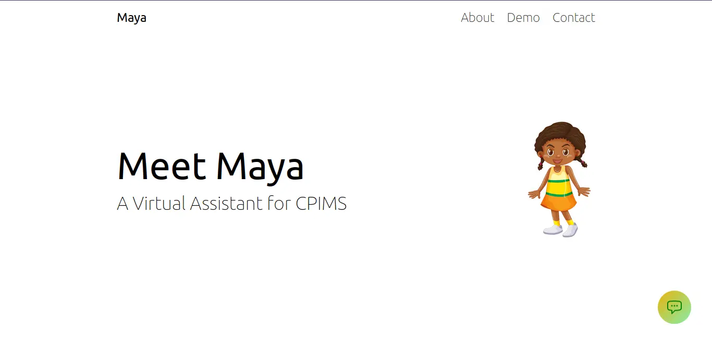
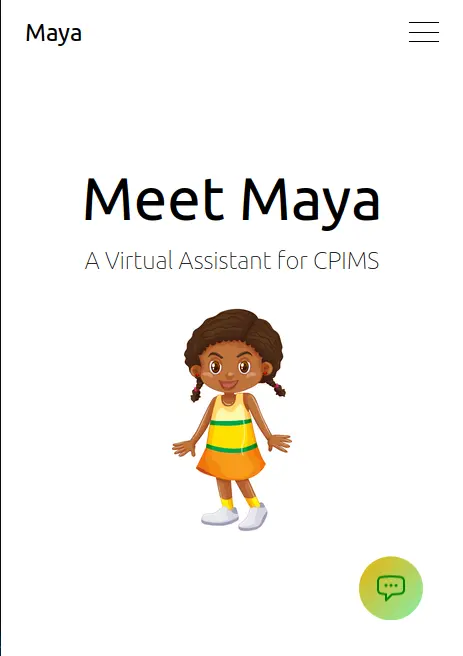

# CPIMS Virtual Assistant Chatbot (Maya)

Maya is a virtual assistant chatbot built to provide assistance to users of the Child Protection Information Management Service (CPIMS). It is designed to provide users with quick and accurate responses to common queries and questions related to child protection.



## Contributors

1. Oriel Kiplangat - kiplangatoriel@gmail.com
2. Gilks Moseti - gilksmoseti@gmail.com
3. Aloys Aboge Jr - junioraboge@gmail.com
4. Bildad Moses Okoth - bildadmoses8@gmail.com

## Business Understanding

The client in a CPIMS user support virtual assistant project is likely an organization working with children and using CPIMS. The client needs an automated solution to handle repetitive user support requests, which are time-consuming for their service desk staff. The virtual assistant should be user-friendly, accessible, available 24/7, handle a variety of requests, and provide fast and accurate answers. Input and feedback from CPIMS users will be critical to ensure the virtual assistant meets the client's needs.

We identified client needs by gathering data from a whatsapp chat that contained inputs and feedback from CPIMS users. The inputs had similar questions from CPIMS users making the help desk repeat the same answers overtime. We ensured the virtual assistant met the client needs by aiding in answering the common questions.

## Data Acquisition

Data was collected from exported whatsapp chats with
<br>
• Nairobi County CPIMS <br>
• Msa CCI’s & DCS CPMIS WhatsApp Chat with CPIMS WAJIR TEAM <br>
• WhatsApp Chat with INSTITUTIONS CPIMS GROUP <br>
• WhatsApp Chat with BUNGOMA CPIMS GROUP

The data acquisition was quite simple as the dataset was readily provided by the CPIMS team.

## Explanatory Data Analysis

The cleaned and prepared data was analyzed to identify <br>
● patterns<br>
● Trends<br>
● insights <br>
that can help inform the development of the virtual assistant.

This analysis could include techniques such as:- <br>
● data visualization<br>
● Clustering<br>
● natural language processing (NLP) <br>
to identify common themes and patterns in user queries.

## Data cleaning and preparation

The data was cleaned and prepared for analysis to ensure that it is consistent, accurate, and complete. It involved <br>
The data for the chatbot was sourced from an exported WhatsApp chat, which was then sorted into an Excel spreadsheet using Pandas. After removing duplicates, the data was divided among four team members for cleaning. Each member was responsible for cleaning a portion of the data, and the resulting clean data was then sorted into queries and responses.
❖ removing duplicates <br>
❖ fixing errors <br>
❖ standardizing data formats.<br>

- We used a cleaning tool called pushbullet which converted the whatsapp.txt file to excel format
- We removed text messages with empty cells and irrelevant data e.g <Media omitted>, “This message was deleted”
  which were repeated multiple times.
- We then read the 4,321 rows of data as we filtered the most frequent questions
- We then created new data sets of the questions with their respective answers.

This provided us with a clear view of the question that was repeatedly asked and the ones which weren’t.
Afterwards we converted the excel folder to JSON which we used for the subsequent processes e.g model training.

## Feature Engineering

We employed discretization as we took the messy data that we had, which was pure text and emojis,emoticons alike and created two separate features possessing similar characteristics i.e. queries and responses which we again filtered based on what was relevant to us. We transformed our raw data into features that were used to build a machine learning mode in the following steps <br>

I. Data selection- we selected the most relevant questions from our cleaned dataset. The messages included queries and possible responses.<br>

II. Feature Extraction- We extracted the queries from the dataset depending on the nature of the queries. We then transformed the extracted queries into Json format that could be used to train the machine learning model. <br>

III. Feature Engineering- Based on the insights gained from data exploration and analysis, we created a data model for the virtual assistant that includes a list of common user queries and the appropriate responses. This model would be designed using machine learning (ML) and NLP algorithms to enable the virtual assistant to recognize and respond to user queries accurately and efficiently. <br>

III. Feature Selection- The queries were selected and grouped based on how they related with each other. We finally had categories such as greetings, resetting passwords etc. <br>

IV. Training the Model- The data model was trained and tested using historical data and simulated user queries to ensure that it accurately recognizes and responds to common user queries. The model would need to be continually refined and improved based on feedback from user interactions with the virtual assistant. <br>

V. Model Evaluation- After training the model using the labeled dataset , it achieved an accuracy of 94.5%, which indicates that it is able to correctly classify support requests and problems for the users <br>

VI. Model Deployment- <br>

## Maya : Building Maya user interface

### Technologies Used

- Python
- Pandas
- TensorFlow
- FastAPI
- Flask
- Websockets
- Tailwind CSS

<hr/>

### Training

The clean data was used to train the chatbot using TensorFlow. The resulting model was then integrated into the web-based chatbot using FastAPI and Flask.

### UI Design

The user interface for the chatbot was designed using Tailwind CSS, a utility-first CSS framework. The interface is simple and easy to use, with a chat window for entering queries and receiving responses from the chatbot.




### Installation and Setup

After forking the repository

1. Clone the project from Github:
   bash

```
git clone https://github.com/your-username/cpims-virtual-assistant.git
```

2. Navigate to the project directory:

_bash_

```
cd cpims-virtual-assistant
```

3. Install the required dependencies:

```
pip install -r requirements.txt
```

4. Run the application:

```
python3 app.py
```

Open the application in your web browser:

```javascript
    http://localhost:8000/maya
```

<hr/>

### Usage

To use the chatbot, simply type a question or query into the chat window and hit "Enter" or click the "Send" button. The chatbot will respond with a relevant answer or suggestion.

<hr/>
   
## Challenges Faced in Handling the Task
   
1.	A lot of the data provided was similar in terms of the questions asked and so was the answers given e.g. resetting the password. This greatly reduced the variability of questions and responses we could feed our chatbot.
2.	The data we were provided with proved to be real difficult to work with as the format (exported WhatsApp chat) needed a lot of time to clean.
3.	Conversion of the file format to suitable format e.g. txt to xlsx to csv to json.
4.	Transferring the output of the bot to the web needs alot of time and proper implementation.
