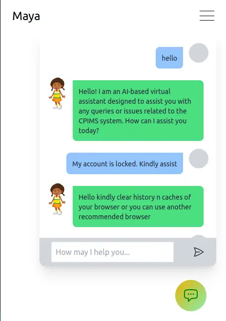

# CPIMS Virtual Assistant Chatbot (Maya)

Maya is a virtual assistant chatbot built to provide assistance to users of the Child Protection Information Management Service (CPIMS). It is designed to provide users with quick and accurate responses to common queries and questions related to child protection.


### Installation and Setup

After forking the repository

1. Clone the project from Github:
   bash

```
git clone https://github.com/your-username/cpims-virtual-assistant.git
```

2. Navigate to the project directory:

_bash_

```
cd cpims-virtual-assistant
```

3. Install the required dependencies:

```
pip install -r requirements.txt
```

4. Run the application:

```
python3 app.py
```

Open the application in your web browser:

```javascript
    http://localhost:8000/maya
```

<hr/>

### Usage

To use the chatbot, simply type a question or query into the chat window and hit "Enter" or click the "Send" button. The chatbot will respond with a relevant answer or suggestion.

<hr/>
### Technologies Used

- Python
- Pandas
- TensorFlow
- FastAPI
- Flask
- Websockets
- Tailwind CSS

<hr/>
### Maya : Behind The Scenes

##### Data Cleaning

The data for the chatbot was sourced from an exported WhatsApp chat, which was then sorted into an Excel spreadsheet using Pandas. After removing duplicates, the data was divided among four team members for cleaning. Each member was responsible for cleaning a portion of the data, and the resulting clean data was then sorted into queries and responses.

#### Training

The clean data was used to train the chatbot using TensorFlow. The resulting model was then integrated into the web-based chatbot using FastAPI and Flask.

#### UI Design

The user interface for the chatbot was designed using Tailwind CSS, a utility-first CSS framework. The interface is simple and easy to use, with a chat window for entering queries and receiving responses from the chatbot.



